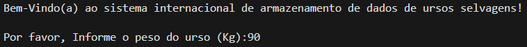
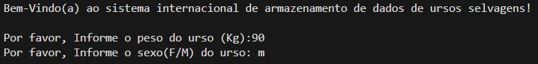
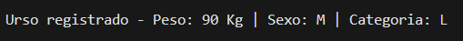
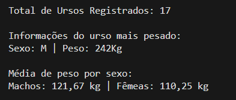
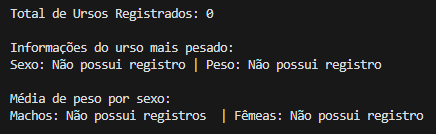
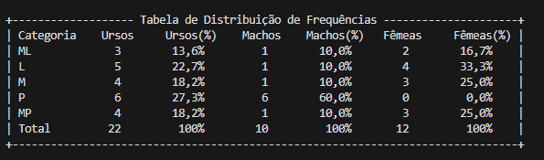
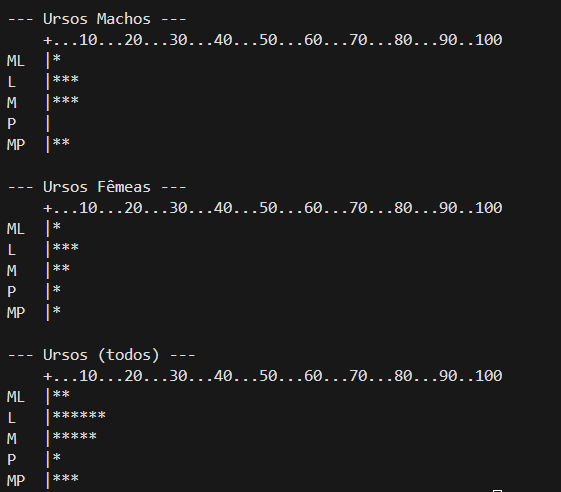

# Projeto para Coleta de Dados de Ursos Selvagens

## Sobre  
Um programa para análise de dados coletados de ursos selvagens. Para cada urso, são registrados o peso (kg) e o sexo (M/F). A coleta é finalizada ao se receber um peso igual a zero, negativo ou acima de 250 kg.

## Download  
Acesse o programa através do [LINK](/Ursos.zip)

## Passo a Passo

### Primeiro, você recebe as boas-vindas ao programa e é solicitado a inserir o peso do urso (em kg):  

### Logo após informar o peso, é solicitado que insira o sexo do urso (F/M):  

### Depois de inserir as informações necessárias, o programa mostra que o urso foi registrado, exibindo seus dados: peso, sexo e categoria.  

### Caso você digite um peso igual a 0 kg, 250 kg ou um valor negativo, o programa é encerrado e exibe as seguintes informações:  

### Caso você digite um peso igual a 0 kg, 250 kg ou um valor negativo, e nenhum urso tenha sido registrado, o programa será encerrado e exibirá as seguintes informações:  

### Depois de exibir as informações, como a média de peso por sexo e as características do urso mais pesado, o programa apresenta uma tabela de distribuição de frequência.  

### Depois de exibir a tabela, o programa apresenta um histograma para ursos machos, ursos fêmeas e todos os ursos.  
