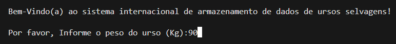
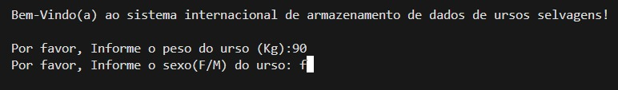
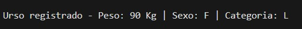

# Projeto para coleta de dados de ursos selvagens

## Sobre
Um programa para análise de dados coletados de ursos selvagens.  Para cada urso, receba o peso (kg) e o sexo (M/F). Finalize a coleta ao receber um peso zero, negativo ou acima de 250kg.

## Download
Acesse o programa atraves do [LINK]()

## Passo a passo

### Primeiro você recebe boas vindas ao programa e é solicitado que insira o peso do urso(em Kg):

### Logo após de informar o peso, é solicitado que insida o sexo do urso(F/M):

### Depois de inserir as informações necessárias, aparece que o urso foi registrado e as informações dele como: peso, sexo, categoria 
